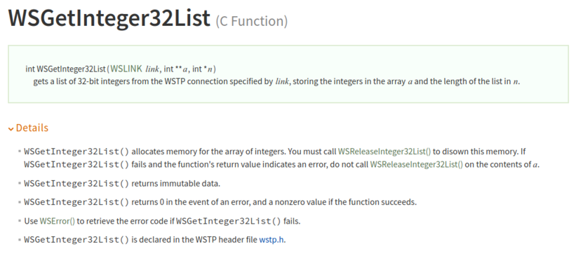
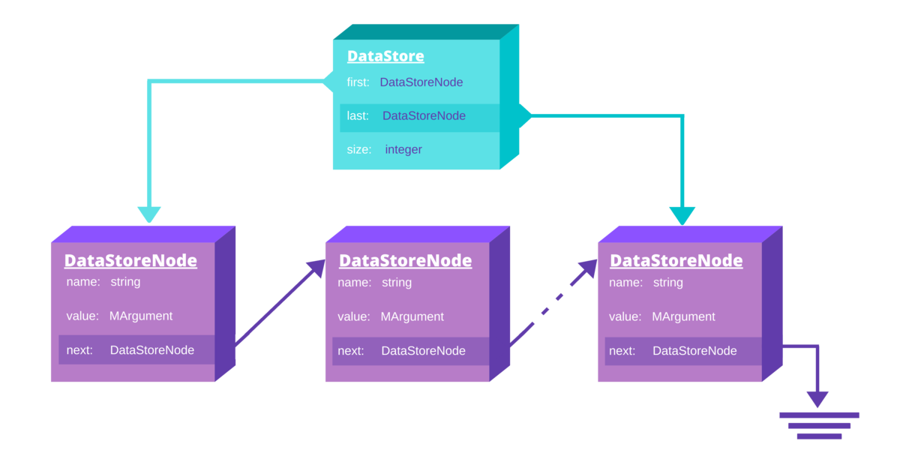

# Integrating C++ and the Wolfram Language with LibraryLink Utilities

If you are a Wolfram Language user with C/C++ background, at some point you might find yourself thinking: 
> *I have this great C++ library, I wish I could use it in my Wolfram Language code.* 

or 

> *I love programming in the WL, but some things are easier for me to implement in C++. If only there was a way to combine these two languages.*

A quick google search reveals two main options: [WSTP](https://reference.wolfram.com/language/guide/WSTPCLanguageFunctions.html) (formerly known as MathLink
) and [LibraryLink](https://reference.wolfram.com/language/guide/LibraryLink.html). They provide interfaces for C programs to exchange data with the
 Wolfram Language and to perform operations on either side. Both frameworks are documented with lots of examples. 
 
 Let us take a look at a sample WSTP function for sending list of integers from the Wolfram Language to a C program:
 
 [](https://reference.wolfram.com/language/ref/c/WSGetInteger32List.html)
 
 If your code already uses error codes, manual memory management, out-parameters, etc. both WSTP and LibraryLink will
  perfectly fit into your codebase.
  
  However, if you prefer to use exceptions for error handling, RAII for resource management, namespaces, templates and other modern C++ techniques, you might
   find the integration slightly more challenging.

The remaining part of this text assumes that the reader has basic knowledge of LibraryLink.

## LibraryLink Utilities

One thing that can help you achieve seamless integration of C++ and WL is called *LibraryLink Utilities* (abbr. **LLU**) which is a set of modern C++ wrappers
 over
 LibraryLink and WSTP. LLU is developed and maintained by Wolfram Research and it has been released under the MIT license on GitHub:

https://github.com/WolframResearch/LibraryLinkUtilities

With documentation and examples also available online:

https://wolframresearch.github.io/LibraryLinkUtilities/

We do not provide prebuilt binaries of LLU, so the only way to use it is by building locally from sources. The most common approach is to clone the repository
from one of the following URLs:

| **[ssh]**   | `git@github.com:WolframResearch/LibraryLinkUtilities.git`     |
|-------------|---------------------------------------------------------------|
| **[https]** | `https://github.com/WolframResearch/LibraryLinkUtilities.git` |

Alternatively, a zip package can be downloaded from GitHub containing a snapshot from any branch.

## Demo

Let's see how to write a complete C++ package for Wolfram Language using LLU. We will analyze a toy paclet named "Demo" which is shipped with LLU (under
 `/tests/Demo`). This paclet exposes two functions to the Wolfram Language:
 
 - `CaesarCipherEncode[message_String, shift_Integer]` - encodes given message by shifting every character by shift positions in the English alphabet
   
 - `CaesarCipherDecode[cipherText_String, shift_Integer]` - restores the original message encoded with Caesar's cipher given the encoded text and the shift
 
Such simple functionality in practice would easily be implemented directly in WL without invoking library functions implemented in C++, but when you learn
 the general structure of paclets written with LLU, you can have arbitrarily complex C++ code with all the rest being as simple as in this demo.

### Paclet structure

The demo paclet resides at the `/tests/Demo` directory inside the LLU repo root directory and has the following structure.

```
Demo
├── Demo
│   ├── Kernel
│   │   └── Demo.wl
│   └── PacletInfo.wl
├── Sources
│   └── demo.cpp
├── Tests
│   └── test.wl
└── CMakeLists.txt
```
The first thing you may notice is that Demo paclet uses CMake as a build system (via the presence of CMakeLists.txt). This is the most natural choice because
 LLU 
itself uses CMake and it provides a number of useful CMake utilities. It is possible to build and install LLU with CMake but then use different build system
 in paclets, or even just ``CCompilerDriver`CreateLibrary``.
 
As you can see, our Demo follows the general paclet structure described in the 
[Paclet Development Guide](https://www.wolframcloud.com/obj/tgayley/Published/PacletDevelopment.nb) - we have a Kernel directory with WL sources and the
 required `PacletInfo.wl` with paclet's metadata. Additionally, we store C++ sources in `Sources` directory and a minimal set of tests in `Tests`. Having
  unit tests in a paclet is not required but often a good practice.
  
### Installation
 
To be able to use the Wolfram Language functions that the Demo provides, it is enough to follow these steps:

1. Configure, build and install LLU as described 
[in the documentation](https://wolframresearch.github.io/LibraryLinkUtilities/basic/how_to_use.html#configure). 
Let’s say you chose `/my/workspace/LLU` as the install directory.

2. Navigate to `tests/Demo` in the LLU source directory - this is where the sources of the Demo project reside.

3. Run the following commands (or equivalent for your system):

    ```commandline
    cmake -DLLU_ROOT=/my/workspace/LLU -DWolframLanguage_ROOT=/path/to/WolframDesktop/ -B build
    cd build/
    cmake --build . --target install
    ```
   
   (where `/path/to/WolframDesktop` is a path to the Wolfram product (i.e. Wolfram Desktop/Mathematica/Wolfram Engine) you have installed)


This will put a complete paclet directory structure under `tests/Demo/build/Demo`. You can copy this directory into 
[`$UserBaseDirectory/Applications`](https://reference.wolfram.com/language/ref/$UserBaseDirectory.html) and then load the paclet by calling 
``Needs["Demo`"]`` in a notebook.

However, a preferred way to make the paclet discoverable by the Wolfram Language is to build another target called `paclet`

```commandline
cmake --build . --target paclet
```

When built, the `paclet` target will take the directory structure created by the `install` target and turn it into a proper `.paclet` file. It can optionally 
validate paclet contents, run a test file or install the paclet to a directory where the Wolfram Language can automatically find it. Investigate the 
`tests/Demo/CMakeLists.txt` file for details on how to create and use this target.

Finally, after building the `paclet` target or manually copying the Demo paclet into the user paclet directory, you should be able to run the following code
 in a notebook:

```mathematica
In[1]:= Needs["Demo`"]

In[2]:= Demo`CaesarCipherEncode["HelloWorld", 5]

Out[2]= "Mjqqtbtwqi"

In[3]:= Demo`CaesarCipherDecode[%, 5]

Out[3]= "HelloWorld"
```

### Using Demo as paclet template

Demo paclet is intended to serve as a short showcase of LLU capabilities but also as a convenient base for developers to create custom paclets. Let's see 
what changes are necessary to turn Demo into a project of your own.

1. Copy all the sources to a new directory named the same as your new paclet, e.g.

    ```commandline
    cd /path/to/LLU
    cp -r tests/Demo ~/projects/MyPaclet
    ``` 
   
2. Rename all occurrences of "Demo" in directory and file names to "MyPaclet" (or whatever name you chose in step 1). On a Linux system, this step may be 
accomplished as follows:

    ```commandline
    cd ~/projects/MyPaclet
    mv Demo MyPaclet
    mv MyPaclet/Kernel/Demo.wl MyPaclet/Kernel/MyPaclet.wl
    mv Sources/demo.cpp Sources/mypaclet.cpp
    ``` 

3. Modify source files (you can use `sed` on Linux or `Find & Replace` function in your favorite IDE):

    1. Change the ``Demo` `` context in *MyPaclet.wl* and *Tests/test.wl* to ``MyPaclet` ``
    2. Rename the main target and variable names in *CMakeLists.txt*
    3. In *MyPaclet.wl* change the library name in line `` `LLU`InitializePacletLibrary["Demo"];`` to `"MyPaclet"`.

4. Unleash your creativity! Remove the two library functions defined by the Demo project and write your own code instead.

## Examples

Now that you know how to easily create WolframLanguage paclets that use LLU, let's see a number of common use cases and applications where LLU is especially
handy compared to plain LibraryLink or WSTP. All the C++ code snippets shown below require `LLU/LLU.h` and possibly other header files to be included but
this is omitted for brevity. For the WL snippets, whenever a library function is loaded and used we assume that this was preceded with a proper paclet
loading routine which includes an evaluation of ``LLU`InitializePacletLibrary["LibraryName"]``. This part should be clear after following the instructions in
the previous section.

### Working with numeric data

Exchanging numerical data between C++ and the Wolfram Language is one of the most popular tasks for LibraryLink. Initially, one could transfer scalars or
 tensors of type: integer, real or complex. Although this seems to cover all the common cases, it is often desired to have a finer control over the data type.
 For instance, if we know that all our data is in range 0 - 100 we can store each number in 1 byte, whereas tensors (a.k.a packed arrays) use 4 or 8 bytes
  per element. For this reason
 LibraryLink now supports [NumericArrays](https://reference.wolfram.com/language/ref/NumericArray.html).

Consider a simple function that takes a packed array of real numbers and returns a copy of the input array but with all the numbers clipped to 
[0, 1] interval:

```cpp
EXTERN_C DLLEXPORT int ClipToUnitInterval(WolframLibraryData libData, mint Argc, MArgument *Args, MArgument Res) {

    // Create MArgumentManager to manage all the input and output arguments for the library function
    LLU::MArgumentManager mngr(libData, Argc, Args, Res);

    // The first argument should be our tensor of real numbers, otherwise the following line will throw an exception
    const auto data = mngr.getTensor<double>(0);

    // We will return a copy of the input array with some values modified
    auto clipped = data.clone();

    // We iterate over all elements of the container in a single loop even if the Tensor is multidimensional
    for (auto& d : clipped) {
        d = std::clamp(d, 0., 1.);
    }

    // Set function result
    mngr.set(clipped);

    return LLU::ErrorCode::NoError;
}
```
or, if one is not afraid to use a macro, we can hide all the boilerplate code:

```cpp
LLU_LIBRARY_FUNCTION(ClipToUnitInterval) {
    const auto data = mngr.getTensor<double>(0);

    auto clipped = data.clone();

    for (auto& d : clipped) {
        d = std::clamp(d, 0., 1.);
    }
    mngr.set(clipped);
}
```

Such library function can be loaded and used in the Wolfram Language as follows:

```mathematica
In[1]:= LLU`PacletFunctionSet[ClipToUnitInterval, "ClipToUnitInterval", {{Real, 1}}, {Real, _}];

In[2]:= ClipToUnitInterval[{{0.2, 0.3}, {-0.1, 1.4}}]

Out[2]= {{0.2, 0.3}, {0., 1.}}
```

Our `ClipToUnitInterval` works great but is limited to the input arrays of type Real. Oftentimes we want to have a function that works for any type of
 tensor. The simplest solution is to provide 3 almost identical functions: for integers, reals and complex numbers. This gets less feasible for NumericArray, 
 which supports 12 different element types. LLU comes to the rescue here with "generic" containers. For every container `X` that is templated with element type
 (such as `LLU::NumericArray` or `LLU::Image`) an `LLU::GenericX` is provided, which is a type-unaware counterpart of `X`.
 
For instance, we can write
```cpp
const auto numericArr = mngr.getNumericArray<double>(0);
```
if the only thing that we want to accept as the first argument passed to the function is a NumericArray of type "Real64". If we want to accept any NumericArray,
 we can instead write:
```cpp
const auto numericArr = mngr.getGenericNumericArray(0);
```
our code is thus more flexible but we cannot access the underlying data of `numericArr` directly (because we don't know its type). We could write a `switch`
statement that would detect the data type at run-time and act accordingly; we could also use a helper function from LLU called `LLU::asTypedNumericArray` which
 takes
a generic NumericArray, and an action to perform on this array, which behaves as if the data type of the array was known. For instance

```cpp
LLU_LIBRARY_FUNCTION(Reverse) {
    // Receive a NumericArray of any type as the first argument to the library function
    auto numericArr = mngr.getGenericNumericArray(0);
    
    // Perform an action (second argument) on the numericArr. The typedNA passed to the lambda is a strongly typed LLU::NumericArray.
    LLU::asTypedNumericArray(numericArr, [&mngr](auto&& typedNA) {
        // Extract data type from the argument, this can be simplified in C++20 with a template parameter list for the lambda
        using T = typename std::remove_reference_t<decltype(typedNA)>::value_type;
        // Create a "reversed" copy of the array preserving the type and dimensions.
        auto reversedArr = LLU::NumericArray<T>(std::crbegin(typedNA), std::crend(typedNA), LLU::MArrayDimensions {typedNA.getDimensions(), typedNA.getRank()});
        // Set the reversed array as the result
        mngr.set(std::move(reversedArr));
    });
}
```

### Error handling

If every function that we write always succeeded with no errors, programming would be much easier. Alas, errors do happen for many various reasons;
proper handling and reporting to the caller is one of the most challenging tasks, especially for API functions. LibraryLink, like many C libraries,
uses integer error codes with [7 predefined values](https://reference.wolfram.com/language/LibraryLink/tutorial/LibraryStructure.html#394079419).

In C++, however, an often preferred method of error handling is via exceptions. LLU conforms with this practice and uses exceptions both to report problems that
occurred in its own code and to allow programmers to throw exceptions in their library functions. Such exceptions may even be propagated up to 
the Wolfram Language and transformed into `Failure` objects. This is described in more details in the 
[LLU documentation](https://wolframresearch.github.io/LibraryLinkUtilities/modules/error_handling.html).

Imagine we expect two different exceptional situations that may occur in our code. For each of them, we register a separate kind of exception, with different
name and short textual description which may contain template slots populated at run time. The registration should be done inside `WolframLibrary_initialize`
and may look like this:

```cpp
EXTERN_C DLLEXPORT int WolframLibrary_initialize(WolframLibraryData libData) {
    LLU::LibraryData::setLibraryData(libData);
    LLU::ErrorManager::registerPacletErrors({
        {"NoSourceError", "Requested data source does not exist."},
        {"EmptySourceError", "Requested data source has `elemCount` elements, but required at least `elemReq`."}
    });
    return LLU::ErrorCode::NoError;
}
```

With this simple setup we can now throw exceptions from the function that reads data:

```cpp
void readData(DataSource* source) {
    if (!source) {
        LLU::ErrorManager::throwException("NoSourceError");
    }
    if (source->elemCount() < 3) {
        LLU::ErrorManager::throwException("EmptySourceError", source->elemCount(), 3);
    }
    //...
}
```
Each call to `LLU::ErrorManager::throwException` causes an exception of class `LLU::LibraryLinkError` with predefined name and error code to be thrown. All
 parameters of `throwException` after the first one are used to populate consecutive template slots in the error message. The only thing left to do now 
 is to catch the exception. Usually, you catch only in the interface functions (the ones with `EXTERN_C DLLEXPORT`), extract the error code from exception 
 and return it:

```cpp
EXTERN_C DLLEXPORT int ReadData(WolframLibraryData libData, mint Argc, MArgument *Args, MArgument Res) {
    auto err = LLU::ErrorCode::NoError;    // no error initially
    try {
        //...
    } catch (const LLU::LibraryLinkError& e) {
        err = e.which();    // extract error code from LibraryLinkError
    } catch (...) {
        err = LLU::ErrorCode::FunctionError;   // to be safe, one may want to handle non-LLU exceptions as well and return generic error codes
    }
    return err;
}
```

LLU can later recognize this error code on the WL side and create a proper `Failure` object corresponding to the exception that was thrown on the C++ side.

#### Custom exception class

It is possible to make `ErrorManager` throw exceptions of different class than `LibraryLinkError` as long as this class defines a publicly accessible
 constructor which takes `const LibraryLinkError&` as the first argument. This feature might be useful when we want a custom action to happen right before
 throwing, for instance logging some information to a text file. Consider a simple example:
 
 ```cpp
// Define custom error class. LoggingError inherits from LibraryLinkError and additionally logs file name, function name and line number to a file.
struct LoggingError : LLU::LibraryLinkError {

    // Where to log exception details
    static constexpr const char* logFileName = "LLUErrorLog.txt";
    
    template<typename... T>
    LoggingError(const LLU::LibraryLinkError& e, WolframLibraryData ld, int line, const std::string& file, const std::string& func, T&&... params)
            : LLU::LibraryLinkError(e) {
        
        // Pass LibraryLinkError's parameters to top-level
        setMessageParameters(ld, std::forward<T>(params)...);
        sendParameters(ld);
        
        // Extend debug info to contain file and function names and append to the log file
        setDebugInfo("Exception " + name() + " in " + file + ":" + std::to_string(line) + " in " + func + ": " + debug());
        std::ofstream log {logFileName, std::ios_base::app};
        log << debug() << "\n";
    }
};

// Helper macro to conveniently throw LoggingErrors with current line, filename and function name
#define THROW_LOGGING_ERROR(name, ...) LLU::ErrorManager::throwCustomException<LoggingError>(name, libData, __LINE__, __FILE__, __func__, __VA_ARGS__)
```
This class can be used as follows:

```cpp
EXTERN_C DLLEXPORT int ReadDataWithLoggingError(WolframLibraryData libData, mint Argc, MArgument *Args, MArgument Res) {
    auto err = LLU::ErrorCode::NoError;
    try {
        LLU::MArgumentManager mngr(Argc, Args, Res);
        auto fileName = mngr.getString(0);
        if (fileName.find(':') != std::string::npos) {
            THROW_LOGGING_ERROR("DataFileError", fileName, 0, R"(file name contains a possibly problematic character ":")");
        }
        auto fileNameLen = static_cast<wsint64>(fileName.length());
        if (fileNameLen > 16) {
            THROW_LOGGING_ERROR("DataFileError", fileName, fileNameLen, "file name is too long");
        }
        THROW_LOGGING_ERROR("DataFileError", fileName, fileNameLen, "data type is not supported");
    }
    // The error handling code can remain as before, because our custom exception class inherits from LLU::LibraryLinkError
    catch (const LLU::LibraryLinkError& e) {
        err = e.which();
    } catch (...) {
        err = LLU::ErrorCode::FunctionError;
    }
    return err;
}
```

#### Top-level layer

Apart from the C++ code, paclets often have nontrivial amount of Wolfram Language code where errors might also occur. In order to achieve uniform 
error reporting across C++ and WL, one needs to register errors specific to the WL layer of the paclet:

```mathematica
`LLU`RegisterPacletErrors[<|
   "InvalidInput" -> "Data provided to the function was invalid.",
   "UnexpectedError" -> "Unexpected error occurred with error code: `errCode`."
|>];
```

`RegisterPacletErrors` takes an `Association` of user-defined errors of the form

    error_name -> error_message

Such registered errors can later be issued from the Wolfram Language part of the project like this:

```mathematica
status = DoSomething[input];
If[Not @ StatusOK[status],
   `LLU`ThrowPacletFailure["UnexpectedError", "MessageParameters" -> <|"errCode" -> status|>]
]
```

Alternatively, one can use ``LLU`CreatePacletFailure`` which returns the `Failure` object as the result instead of throwing it.

### Monitoring progress

If functions in your library are meant to work on potentially large amounts of data, and are likely to take considerable amount of time to complete, it is a
 good idea in terms of user experience to provide some kind of indication to the user of how far the function is from completing and to allow users to abort
  the functions execution at any point. LibraryLink offers the latter in the form of 
  [AbortQ](https://reference.wolfram.com/language/LibraryLink/ref/callback/AbortQ.html) 
  function which lets you check whether an abort was requested and then act accordingly (e.g. stop the computation, clean up, return).

LLU goes one step further and provides a mechanism for functions to report progress to the caller on the Wolfram Language side. The basic form of reporting
 progress is simply a real number that is shared between the WL and C++ code. During a library function execution, the number is updated from the C++ code and
  those
  changes can be reflected on the WL side in many different ways to give user a visual indication of current progress, e.g. using 
  [ProgressIndicator](https://reference.wolfram.com/language/ref/ProgressIndicator.html).
  
Imagine we want to write a simple function `SleepTight` that simply sleeps in a loop moving the progress bar in a steady pace. From the caller's perspective
, this
 function takes a single argument - total time (in seconds) for the function to complete. We could load this function in the WL like this:
 
```mathematica
LLU`PacletFunctionSet[SleepTight, "SleepTight", {Real}, "Void", "ProgressMonitor" -> MyPaclet`PM`SleepTight];
```

Notice that for progress reporting to work on the Wolfram Language side as expected, the library function must be loaded with extra option 
`“ProgressMonitor” -> x`, where `x` is a Symbol. Every time your library function reports progress, the new progress value will be assigned to `x`.
By default, `“ProgressMonitor” -> None` is used. It is a good idea to make sure the name for the monitoring symbol will be unique. One suggestion is to use
 ``PacletName`PM`` as the context, and the name of the symbol to be the same as the function name.

Now, one can run the library function with simple progress bar:

```mathematica
Monitor[
    (* the function will run for 5 seconds *)
   SleepTight[5], 
    (* check the value of progress every 0.2 second and display as progress bar *)
   ProgressIndicator[Dynamic @ First @ Refresh[MyPaclet`PM`SleepTight, UpdateInterval -> 0.2]] 
]
```
The remaining task of implementing the function on the C++ side is fairly straightforward:

```cpp
EXTERN_C DLLEXPORT int SleepTight(WolframLibraryData libData, mint Argc, MArgument *Args, MArgument Res) {

   // Create MArgumentManager to manage all the input and output arguments for the library function
   LLU::MArgumentManager mngr(libData, Argc, Args, Res);

   // Get the first argument which determines how many seconds should this function take to evaluate
   auto totalTime = mngr.getReal(0);

   // Calculate number of steps for the progress bar, we want 10 steps per second
   auto numOfSteps = static_cast<int>(std::ceil(totalTime * 10));

   // Get ProgressMonitor instance, initialize with the number of seconds per step
   auto pm = mngr.getProgressMonitor(1.0 / numOfSteps);

   // Sleep in a loop, increase progress in each iteration. Increasing progress also automatically checks for Abort.
   for (int i = 0; i < numOfSteps; ++i) {
      std::this_thread::sleep_for(100ms);
      ++pm;
   }

   return LLU::ErrorCode::NoError;
}
```

### Using WSTP link as a stream

WSTP links can be used to sequentially transfer data between C++ code and the Wolfram Language. It makes them perfect candidates to be represented as streams
in the C++ sense (with "stream operators" `>>` and `<<`). LLU provides such a stream class for WSTP, called `WSStream`. The class takes two non-type template
parameters which represent default encodings to be assumed for C-string and `std::string`s that sent or received via the stream.

A sample function that receives a number of UTF8 strings from the link and puts back a total byte-length of all the strings, could look like this:

```cpp
LIBRARY_WSTP_FUNCTION(StringsByteLength) {
    WSStream<WS::Encoding::UTF8> stream {wsl};
    
    std::vector<std::string> strs;
    stream >> strs;

    auto total = std::accumulate(std::cbegin(strs), std::cend(strs), 0UL, [](auto sum, const std::string& s) { return sum + s.length(); });

    stream << total << WS::EndPacket;
}
```

Which could then be loaded and used in the Wolfram Language as follows:

```mathematica
In[1]:= LLU`WSTPFunctionSet[StringsByteLength, "StringsByteLength"];

In[2]:= StringsByteLength["a", "bb", "ccc"]

Out[2]= 6
```

A slightly more complicated example could involve a function that accepts a list of integers and returns an Association with a list of divisors for each of the 
input integers, or `$Failed` if the number has more than 15 divisors. This example demonstrates how to send expressions whose length is not known a-priori:

```cpp
LLU_WSTP_FUNCTION(FactorsOrFailed) {
     WSStream<WS::Encoding::Byte> stream {wsl, 1};    // we expect 1 input argument - a list of integers

    std::vector<int> numbers;
    stream >> numbers;

    stream << WS::Association(numbers.size());      // the output Association will have the same length as the input list even if the list contains duplicates
    for (auto n : numbers) {                        // duplicates will be automatically taken care of on the WL side
        stream << WS::Rule << n;
        stream << WS::BeginExpr("List");    // we do not know the number of factors so we have to use WS::BeginExpr
        int divisors = 0;
        for (int j = 1; j <= n; ++j) {
            if (n % j == 0) {
                if (divisors < 15) {
                    stream << j;
                    divisors++;
                } else {
                    stream << WS::DropExpr();    // Drop the List that and send $Failed instead
                    stream << WS::Symbol("$Failed");
                    break;
                }
            }
        }
        stream << WS::EndExpr();
    }
    stream << WS::EndPacket;
}
```

We can now load our function and use it like this:

```mathematica
In[1]:= LLU`WSTPFunctionSet[Factors, "FactorsOrFailed"];

In[2]:= Factors[{1, 3, 15, 10000000, 15}]

Out[2]= <|1 -> {1}, 3 -> {1, 3}, 15 -> {1, 3, 5, 15}, 10000000 -> $Failed|>
```

WSTP is very flexible and lets you exchange arbitrary expressions between the Wolfram Language and C++ code but it comes with a price - bigger overhead compared
to data transfer via LibraryLink arguments.

### Passing and returning heterogeneous lists

LibraryLink has a fixed list of types that can be used as library function arguments and return values. For instance, see the "Details and Options" section in
 the documentation of [LibraryFunctionLoad](https://reference.wolfram.com/language/ref/LibraryFunctionLoad.html). As you can see, it is straightforward to
 pass an array of numeric data, a string or an image but already sending a list of images is hard. One can conform all the images and transfer them via
 LibraryLink as a single `Image3D` but this puts a toll on efficiency. Sending a list of strings is simply impossible without tricks or workarounds.
 
 This topic has been brought up by the community quite a few times:
 
 - [Returning multiple results from a LibraryLink function](https://mathematica.stackexchange.com/questions/31545/returning-multiple-results-from-a-librarylink-function)
 - [Is it possible to let LibraryLink return multiple results?](https://mathematica.stackexchange.com/questions/121825/is-it-possible-to-let-librarylink-return-multiple-results)
 - [LibraryFunctionLoad for multivariate C++ function containing several arguments](https://mathematica.stackexchange.com/questions/128723/libraryfunctionload-for-multivariate-c-function-containing-several-arguments)
 - [LibraryFunctionLoad with variable number of arguments](https://community.wolfram.com/groups/-/m/t/366849)
 - [Working with a variable number of arguments in LibraryLink](https://community.wolfram.com/groups/-/m/t/190560)
 
It turns out that the solution to this problem already exists in LibraryLink and is called `DataStore`. The only problem is that for now it remains
 undocumented. Below is a quick glimpse of what `DataStore` is, which should also help understand the C++ wrappers of `DataStore` that LLU has to offer. 
 
 
 
 As can be seen in the picture, `DataStore` is a simple unidirectional linked list but with limited functionality exposed, compared for instance to 
 `std::forward_list`. The API provided in the Wolfram Library allows for 
 
 - creating an empty `DataStore`
 - copying or deleting existing `DataStore`
 - appending new nodes at the end
 - iterating over nodes
 - obtaining the length of the store (in constant time)
 
 Each node of the `DataStore` carries a value of type `MArgument`, which is a union type of all types that LibraryLink can handle as function arguments or
 return values. The `MArgument` union include `DataStore` which means that the store can be nested. Additionally, every node contains an optional "name" which
 can be any string. Names do not have to be unique. 

A simple library function that takes a list of strings (in the form of a `DataStore`) and returns a new list with each of the input strings reversed, 
implemented in pure LibraryLink may look like this:

```cpp
EXTERN_C DLLEXPORT int StringsReversedLibraryLink(WolframLibraryData libData, mint Argc, MArgument *Args, MArgument Res) {

    // get DataStore which is the first input argument to the library function
    DataStore ds_in = MArgument_getDataStore(Args[0]);

    mint length = libData->ioLibraryFunctions->DataStore_getLength(ds_in);

    // create new DataStore to hold the result
    DataStore ds_out = libData->ioLibraryFunctions->createDataStore();
    if (ds_out == nullptr) {
        // error handling
    }
    
    // start traversing the DataStore from the first node
    DataStoreNode dsn = libData->ioLibraryFunctions->DataStore_getFirstNode(ds_in);
    while (dsn != nullptr) {
        MArgument node_data;
        if (libData->ioLibraryFunctions->DataStoreNode_getData(dsn, &node_data) != 0) {
           // error handling and cleanup
        }
        if (libData->ioLibraryFunctions->DataStoreNode_getDataType(dsn) != MType_UTF8String) {
           // error handling and cleanup
        }
        // reverse the order of characters in the string and push to the output DataStore
        std::string_view s {MArgument_getUTF8String(node_data)};
        std::string outStr(s.rbegin(), s.rend());	 // create reversed copy
        libData->ioLibraryFunctions->DataStore_addString(ds_out, outStr.data());

        // move to the next node
        dsn = libData->ioLibraryFunctions->DataStoreNode_getNextNode(dsn);
    }
    // set the newly created DataStore as the result of this library function call
    MArgument_setDataStore(Res, ds_out);

    return LIBRARY_NO_ERROR;
}
```

It is clear how to operate on `DataStore`s in C code now, but the Wolfram Language side of LibraryLink also uses a representation of this structure and it is
defined as follows:
```mathematica
Developer`DataStore[node_expr$1, node_expr$2, ..., node_expr$n]
```
where each `node_expr` is of the form `string -> expr` or just `expr` with an extra requirement that `expr` must be an expression supported in LibraryLink.

For example, ``Developer`DataStore["abc", "de", "f"]`` passed to the function implemented above would result in ``Developer`DataStore["cba", "ed", "f"]`` being
returned from the library.

LLU provides two direct wrappers over `DataStore`: `LLU::GenericDataList` and `LLU::DataList<T>`. The former equips `DataStore` with a proper container 
interface including methods like `push_back()`, `front()`, `back()` or `length()`. It also offers easier iteration over the list with `begin()` and `end()`.

The second wrapper is templated with a node type and should be used whenever we expect a homogeneous `DataStore` (with all nodes of the same type). The types
that can be passed as template parameter are not the raw LibraryLink types included in the MArgument union but rather their LLU counterparts. For convenience, 
they are enclosed in `LLU::NodeType` namespace with following members:

```cpp
/// Boolean type, corresponds to True or False in the Wolfram Language
using Boolean = bool;

/// Machine integer type
using Integer = mint;

/// Double precision floating point type
using Real = double;

/// Complex number type, bitwise-compatible with mcomplex defined in WolframLibrary.h
using Complex = std::complex<double>;

/// Tensor stands for a GenericTensor - type agnostic wrapper over MTensor
using Tensor = MContainer<MArgumentType::Tensor>;

/// SparseArray stands for a GenericSparseArray - type agnostic wrapper over MSparseArray
using SparseArray = MContainer<MArgumentType::SparseArray>;

/// NumericArray stands for a GenericNumericArray - type agnostic wrapper over MNumericArray
using NumericArray = MContainer<MArgumentType::NumericArray>;

/// Image stands for a GenericImage - type agnostic wrapper over MImage
using Image = MContainer<MArgumentType::Image>;

/// String values from LibraryLink (char*) are wrapped in std::string_view
using UTF8String = std::string_view;

/// DataStore stands for a GenericDataList - type agnostic wrapper over DataStore
using DataStore = MContainer<MArgumentType::DataStore>;
```

Additionally, there is also `LLU::NodeType::Any` which can be used to make `LLU::DataList` work with a heterogeneous `DataStore`. `LLU::DataList` compared to
`LLU::GenericDataList` provides more iteration options (iteration over node values or node names only) and a function to immediately create a `std::vector` out
of the stored values.

Let us implement the same function as above using `LLU::GenericDataList`:

```cpp
EXTERN_C DLLEXPORT int StringsReversedGeneric(WolframLibraryData libData, mint Argc, MArgument *Args, MArgument Res) {
    auto err = LLU::ErrorCode::NoError;
    try {
        using NodeT = LLU::NodeType::UTF8String;

        LLU::MArgumentManager mngr(libData, Argc, Args, Res);
        auto dsIn = mngr.getGenericDataList(0);
        GenericDataList dsOut;
        // iterate over the GeneridDataList with a range-based for loop
        for (auto node : dsIn) {
            // we are dealing with generic DataList, so we need to be explicit about the actual node type
            std::string_view s = node.as<NodeT>();
            std::string reversed {s.rbegin(), s.rend()};    // create reversed copy
            dsOut.push_back(std::string_view(reversed));    // passing a view is fine because DataStore will copy the string immediately
        }
        
        mngr.set(dsOut);
    } catch (const LLU::LibraryLinkError& e) {
        err = e.which();
    } catch (...) {
        err = LLU::ErrorCode::FunctionError;
    }
    return err;

``` 

In the function above we know that all nodes should contain strings, so we could use `LLU::DataList<LLU::NodeType::UTF8String>` instead of the generic data
 list. The code would stay almost the same, except we could simply call `node.value()` to get the corresponding `std::string_view`.
 
 For a different example, consider a function `SeparateKeysAndValue` that takes a data store of named complex numbers and separates it into two data stores:
 one holding names of the original data store and another one with values. For instance, 
 
 ```mathematica
Developer`DataStore["a" -> 1 + 2.5 * I, "b" -> -3. - 6.I, 2I, "d" -> -4]
``` 
would be transformed into
```mathematica
Developer`DataStore[
    "Keys" -> Developer`DataStore["a", "b", "", "d"], 
    "Values" -> Developer`DataStore[1. + 2.5 * I, -3. - 6.I, 2.I, -4.]
]
```
The implementation of such library function may look as follows:
```cpp
EXTERN_C DLLEXPORT int SeparateKeysAndValues(WolframLibraryData libData, mint Argc, MArgument *Args, MArgument Res) {
	LLU::MArgumentManager mngr(libData, Argc, Args, Res);

	auto dsIn = mngr.getDataList<LLU::NodeType::Complex>(0);
	DataList<LLU::NodeType::UTF8String> keys;
	DataList<LLU::NodeType::Complex> values;

    // we use structured bindings to immediately split each node into name and value
	for (auto [name, value] : dsIn) {
		keys.push_back(name);
		values.push_back(value);
	}

	DataList<GenericDataList> dsOut; // the output type is a DataList of DataLists
	dsOut.push_back("Keys", std::move(keys));
	dsOut.push_back("Values", std::move(values));

	mngr.set(dsOut);
}
```

Instead of a single loop with structured bindings, we could also make two passes over the input data list:
```cpp
DataList<LLU::NodeType::UTF8String> keys;
for (auto name : LLU::NameAdaptor {dsIn}) {
    keys.push_back(name);
}

DataList<LLU::NodeType::Complex> values;
for (auto value : LLU::ValueAdaptor {dsIn}) {
    values.push_back(value);
}
```

Notice that we use iterator adaptors `LLU::NameAdaptor` and `LLU::ValueAdaptor` to iterate over a specific property of the nodes (either name or value, 
respectively).

## Summary

LibraryLink Utilities is a new addition to the Wolfram ecosystem providing a convenient way for developers to integrate the Wolfram Language with external
 libraries written in modern C++.
It builds upon existing LibraryLink framework making it more fitting into C++ codebases and providing a number of utilities for easier paclet development
including strongly typed container classes, enhanced error reporting and progress monitoring capabilities, a way to bring object-oriented paradigm into the 
Wolfram Language with Managed Library Expressions, lazy loading of library functions and much more. 

All of this comes with a good integration with CMake and a rich documentation in 2 flavors: doxygen comments for all public entities in the library 
([see here](https://wolframresearch.github.io/LibraryLinkUtilities/doxygen/)) and tutorial-like Sphinx-based documentation 
([here](https://wolframresearch.github.io/LibraryLinkUtilities/)) that covers
the most important aspects of the projects with examples and detailed instructions.

Last but no least, LLU is free and open-source, so anyone is welcome to contribute to this project on GitHub.